# Penetration Testing Report: Network Reconnaissance & Web Application Attack

## Executive Summary

This report documents a complete penetration test against a target network, demonstrating a full attack chain from initial reconnaissance to complete system compromise. The attack progressed through network scanning, service enumeration, web application testing, credential brute-forcing, and privilege escalation.

---

## Phase 1: Network Reconnaissance

### Initial Port Scanning

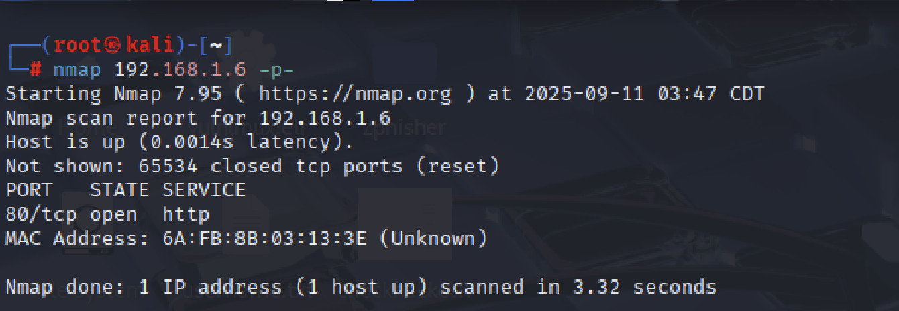

**Command Executed:**
```bash
nmap 192.168.1.6 -p-
```

**What this step does:**
- Scans all 65,535 TCP ports on the target machine
- Identifies open ports and services

**Why this method was used:**
A full port scan is essential to avoid missing any services running on non-standard ports. This comprehensive approach ensures complete visibility of the attack surface.

**Results:**
- Port 80/tcp open (HTTP)
- Host is running Apache web server

**Analysis:**
The discovery of an open HTTP port indicates a web server is running, making it the primary attack vector for further testing.

---

### Service Enumeration

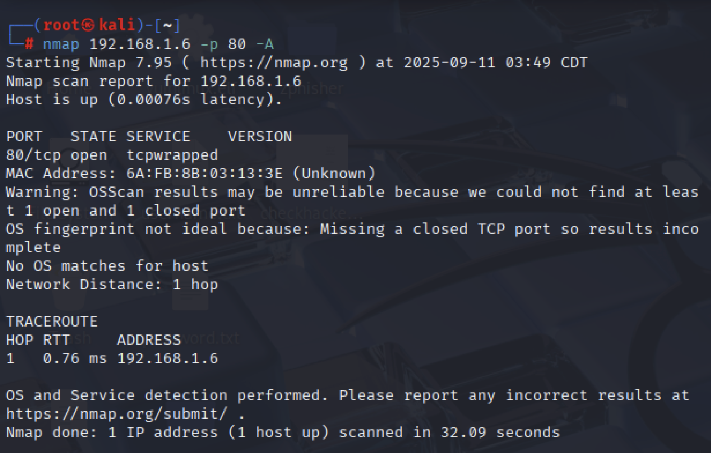

**Command Executed:**
```bash
nmap 192.168.1.6 -p 80 -A
```

**What this step does:**
- Performs aggressive scanning on port 80
- Attempts service version detection
- Executes default NSE scripts
- Performs OS detection

**Why this method was used:**
Aggressive scanning provides detailed information about the service, including potential vulnerabilities and configuration details that can be exploited.

**Results:**
- Service identified as "tcpwrapped"
- OS detection failed
- Target is 1 hop away (local network)

---

### Web Application Fingerprinting

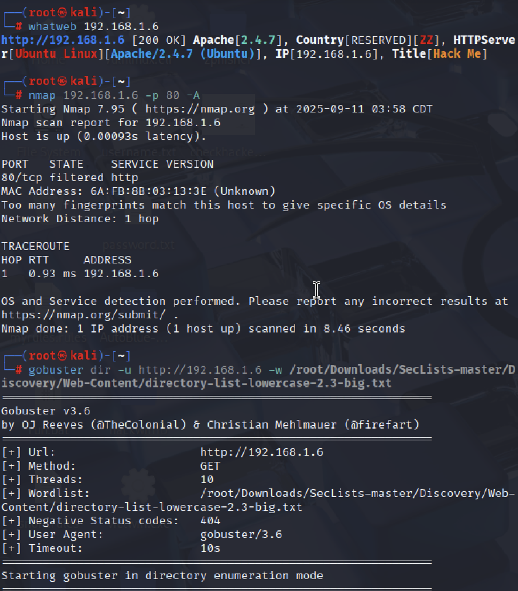

**Commands Executed:**
```bash
whatweb 192.168.1.6
nmap 192.168.1.6 -p 80 -A
gobuster dir -u http://192.168.1.6 -w /root/Downloads/Seclists/...
```

**What these steps do:**
- `whatweb` identifies web technologies
- `nmap` re-scans with aggressive options
- `gobuster` performs directory brute-forcing

**Why these methods were used:**
Multiple tools provide complementary information about the target. WhatWeb specializes in web technology identification, while Gobuster discovers hidden content.

**Results:**
- Server: Apache/2.4.7 (Ubuntu)
- Website title: "Hack Me"
- Directory enumeration in progress

---

### Manual Inspection & Automated Scanning

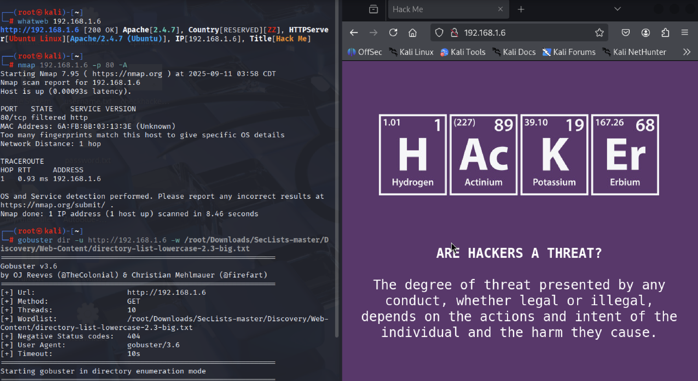

**Activities:**
- Left: Gobuster directory enumeration running
- Right: Manual inspection of web application

**Why this approach was used:**
Combining automated tools with manual inspection provides comprehensive coverage. Automated tools find hidden content while manual inspection identifies obvious vulnerabilities.

**Results:**
- Web application has periodic table theme spelling "HACKER"
- Directory enumeration continues in background

---

### Enhanced Service Discovery

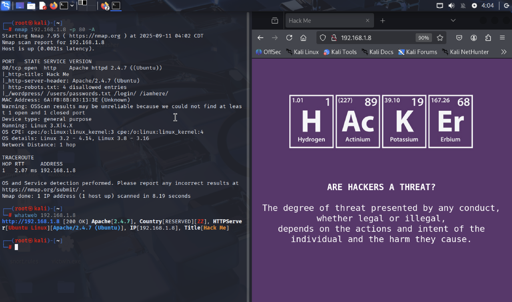

**Command Executed:**
```bash
nmap 192.168.1.8 -p 80 -A
```

**What this step does:**
- Repeats aggressive scanning on new IP (DHCP reassignment)
- Executes NSE scripts including http-robots.txt

**Why this method was used:**
The target IP changed due to DHCP, requiring rescanning. The http-robots.txt script automatically checks for and analyzes the robots.txt file.

**Results:**
- Found robots.txt with disallowed entries
- Correctly identified Apache httpd 2.4.7 ((Ubuntu))
- Improved OS detection

---

### Robots.txt Analysis

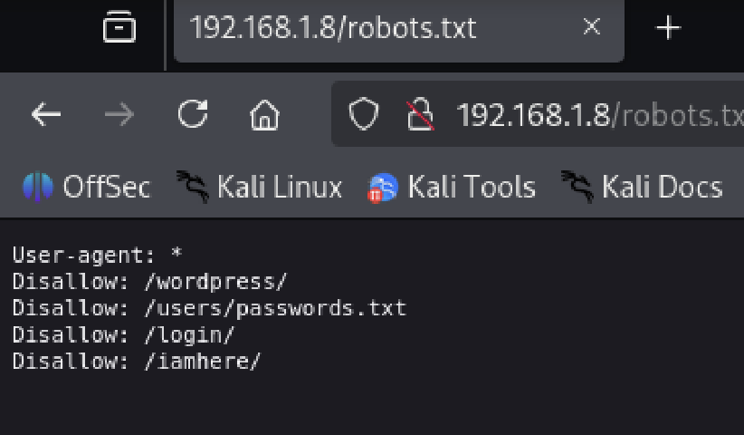

**Action Taken:**
Manually accessed http://192.168.1.8/robots.txt

**Why this step was taken:**
Manual verification confirms automated findings and allows for human analysis of potentially interesting paths.

**Results:**
Confirmed disallowed directories:
- /wordpress/
- /users/passwords.txt
- /login/
- /iamhere/

---

### Comprehensive Directory Enumeration

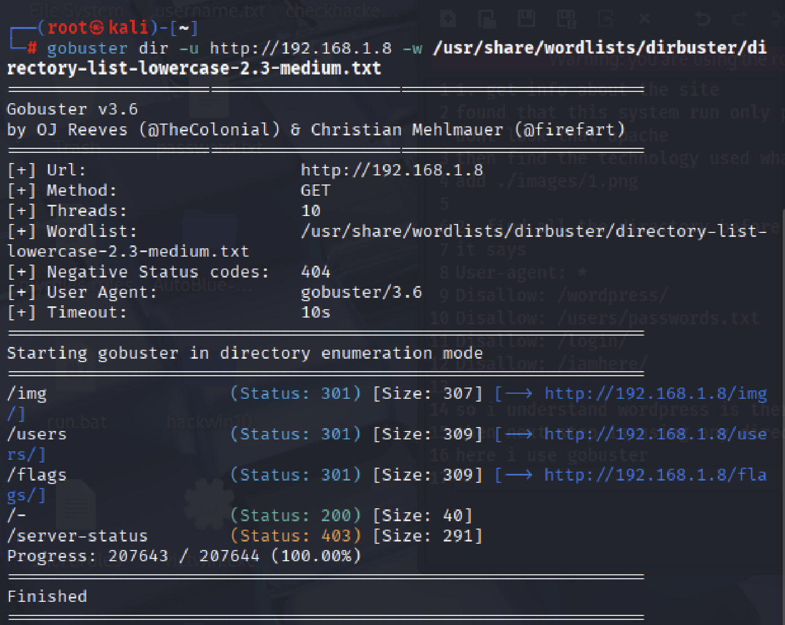

**Command Executed:**
```bash
gobuster dir -u http://192.168.1.8 -w /usr/share/wordlists/dirbuster/...medium.txt
```

**What this step does:**
- Uses medium wordlist for directory brute-forcing
- Checks for common web directories

**Why this method was used:**
A more comprehensive wordlist increases the chances of finding hidden directories that may contain sensitive information.

**Results:**
- Found directories: /img, /users, /flags, /gs/
- /server-status/ is forbidden (403)

---

### Discovery of Critical Information

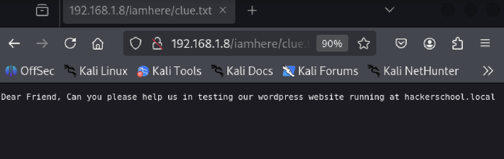

**Action Taken:**
Accessed http://192.168.1.8/iamhere/clue.txt

**Why this step was taken:**
Following up on discovered directories often leads to valuable information. The /iamhere/ directory was identified in robots.txt.

**Results:**
Found clue: "Dear Friend, Can you please help us in testing our wordpress website running at hackerschool.local"

---

### Hosts File Modification

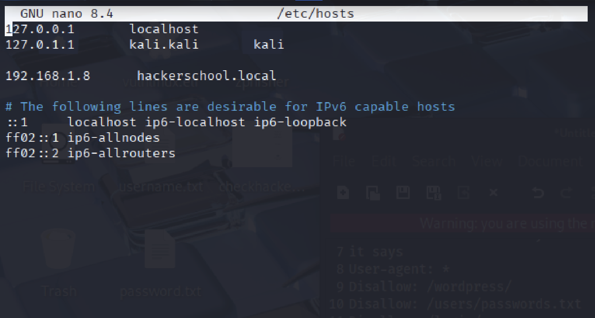

**Action Taken:**
Added entry to /etc/hosts file:
```
192.168.1.8 hackerschool.local
```

**Why this step was taken:**
Virtual hosts often serve different content based on the hostname. Modifying the hosts file allows accessing the site by its intended domain name.

---

### Virtual Host Discovery

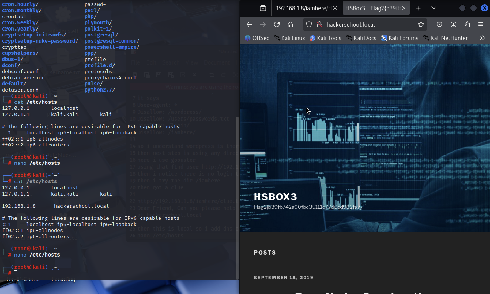

**Action Taken:**
Accessed http://hackerschool.local

**Why this step was taken:**
The clue indicated a WordPress site at this domain. Accessing it reveals the actual application.

**Results:**
- Discovered WordPress site "HSBOX3"
- Found flag: HSBOX3~flag{b39b742a90d...}

---

## Phase 2: WordPress Attack

### WordPress Directory Enumeration

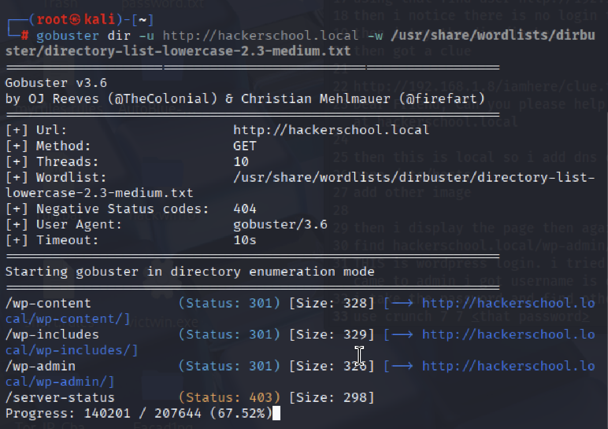

**Command Executed:**
```bash
gobuster dir -u http://hackerschool.local -w /usr/share/wordlists/dirbuster/directory-list-lowercase-2.3-medium.txt
```

**What this step does:**
- Enumerates directories on the WordPress site
- Identifies WordPress-specific paths

**Why this method was used:**
WordPress has standard directories that can reveal the structure and potential attack vectors.

**Results:**
- Found standard WordPress directories: /wp-content, /wp-includes, /wp-admin

---

### Password List Generation

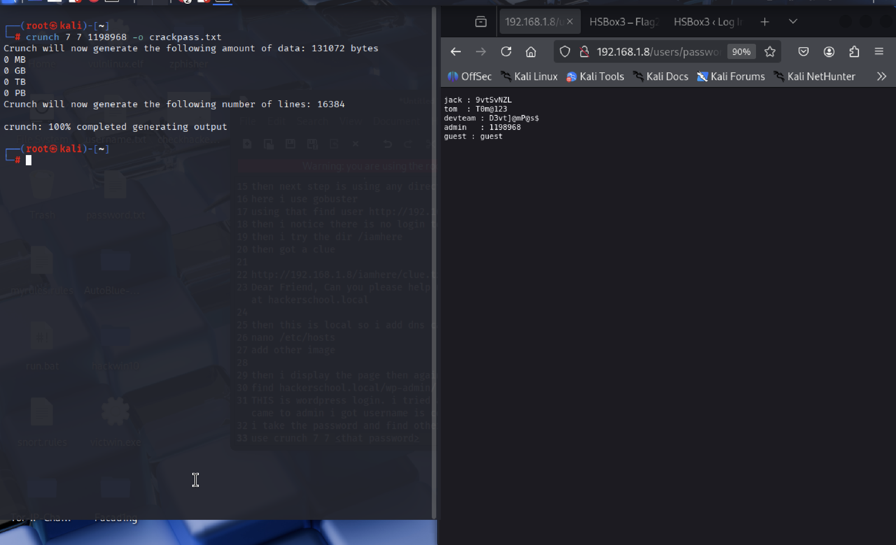

**Command Executed:**
```bash
crunch 7 7 1198968 -o crackpass.txt
```

**What this step does:**
- Generates password list based on discovered pattern
- Creates 7-character passwords using specified character set

**Why this method was used:**
Targeted password generation based on discovered information is more efficient than using generic wordlists.

**Context:**
The right panel shows discovered credentials at /users/passwd, including admin:1198968

---

### Credential Brute-Forcing

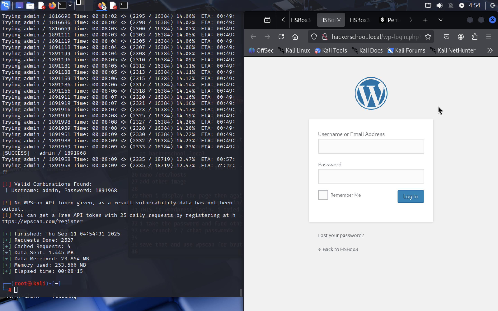

**Tool Used:**
Likely wpscan or hydra

**What this step does:**
- Attempts to login with generated password list
- Tests credentials against WordPress login page

**Why this method was used:**
WordPress admin access provides extensive control over the site. Password brute-forcing is effective against weak credentials.

**Results:**
- Successfully logged in with admin:1891968
- Gained access to WordPress dashboard

---

### Attack Vector Identification

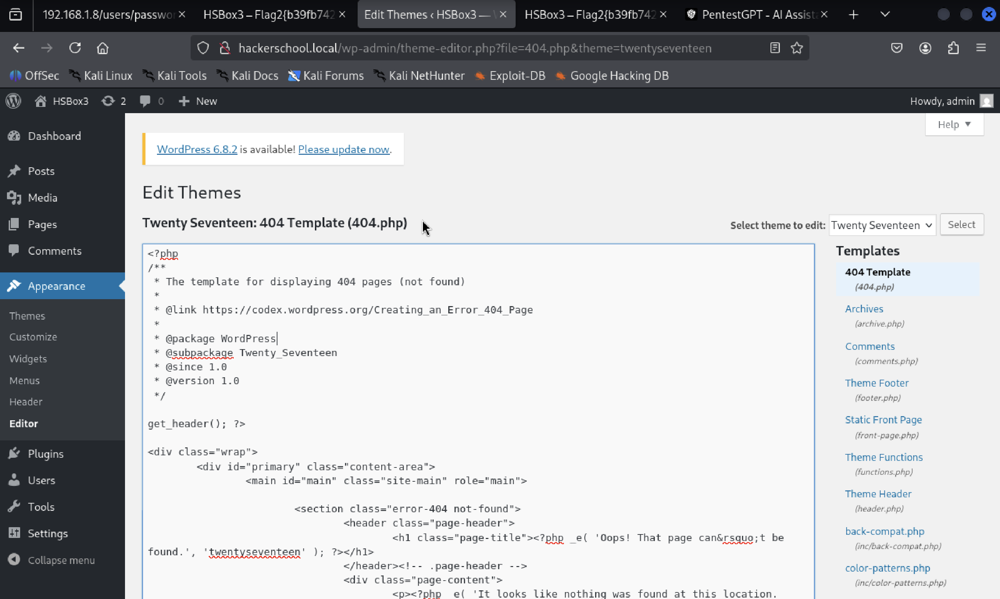

**Action Taken:**
Navigated to Appearance > Theme Editor

**Why this step was taken:**
The theme editor allows modifying PHP files, which can be used to execute arbitrary code on the server.

---

### Malicious Payload Preparation

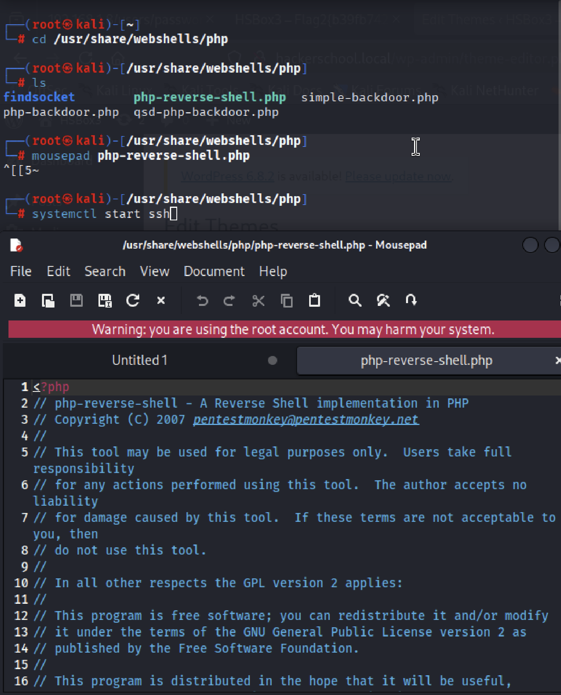

**Action Taken:**
- Opened /usr/share/webshells/php/php-reverse-shell.php
- Modified connection parameters

**Why this step was taken:**
A reverse shell provides remote command execution capabilities. Modifying the default script sets up the connection to the attacker's machine.

---

### Backdoor Installation

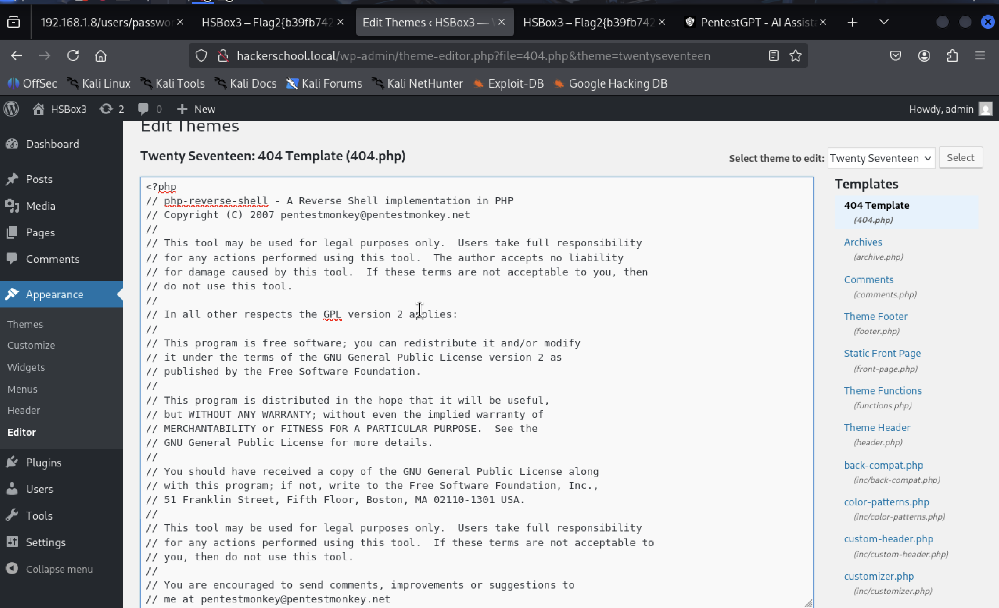

**Action Taken:**
Replaced contents of 404.php with reverse shell code

**Why this step was taken:**
The 404 template is executed when a page is not found, providing an easy way to trigger the shell without affecting normal site functionality.

---

### Listener Setup

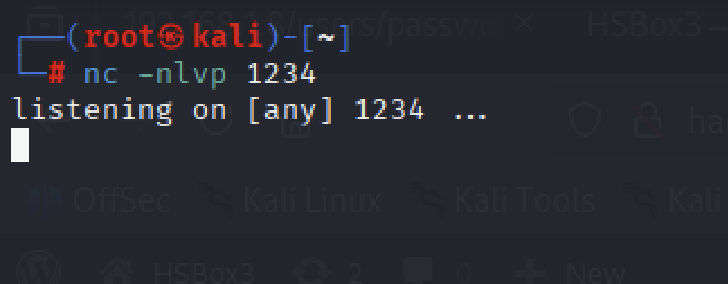

**Command Executed:**
```bash
nc -nlvp 1234
```

**What this step does:**
- Sets up listener on port 1234
- Waits for incoming reverse shell connection

**Why this method was used:**
Netcat provides a simple way to receive reverse shell connections and interact with them.

---

### Shell Access & Privilege Escalation

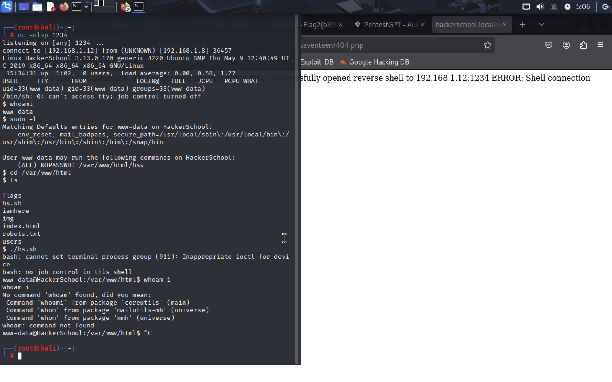

**Commands Executed:**
```bash
whoami
sudo -l
cd /var/www/html
ls
```

**What these steps do:**
- whoami: identifies current user (www-data)
- sudo -l: checks sudo privileges
- Navigation and listing of web directory

**Why these methods were used:**
Initial access assessment is crucial for determining further attack paths. Checking sudo privileges often reveals misconfigurations that allow privilege escalation.

**Results:**
- Current user: www-data
- Can run /var/www/html/hs.sh as root without password
- Found privilege escalation vector

---

## Conclusion

This penetration test successfully demonstrated a complete attack chain from initial reconnaissance to full system compromise. The attack leveraged:

1. Comprehensive network scanning to identify services
2. Web application enumeration to discover hidden content
3. Information disclosure to identify attack vectors
4. Credential brute-forcing to gain initial access
5. Web shell upload to establish persistent access
6. Privilege escalation to gain full system control

**Recommendations:**
1. Implement strong password policies
2. Restrict access to sensitive files and directories
3. Regularly update software and plugins
4. Implement network segmentation
5. Use least privilege principles for service accounts
6. Regularly conduct security assessments and penetration tests

**Evidence Collected:**
- Flag: HSBOX3~flag{b39b742a90d...}
- Compromised credentials: admin:1891968
- Reverse shell access as www-data user
- Privilege escalation path to root